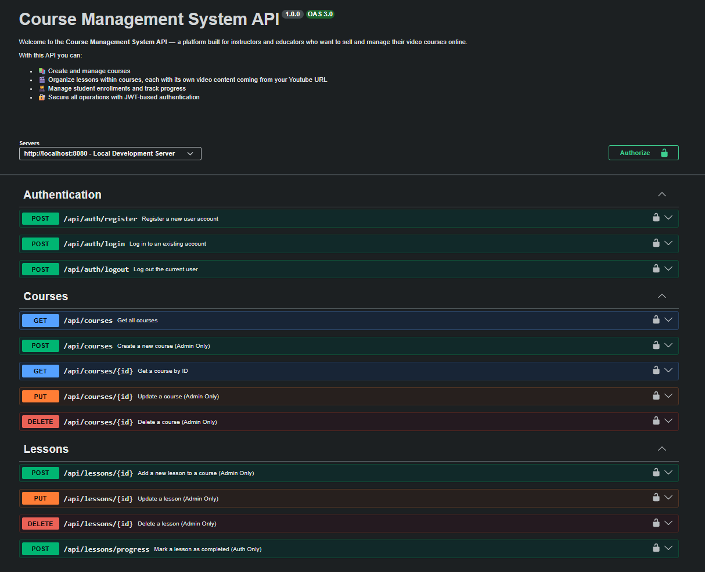

<div align="center">

# Course Management System (CMS) — Backend

</div>

**Purpose:** This repository contains REST endpoints for managing courses, lessons, enrolments, user authentication, analytics and sales. The API is documented with Swagger and intended to be used by the frontend and third-party integrations.

---

## 🚀 Tech Stack

- **Framework:** Node.js, Express, TypeScript  
- **Database:** PostgreSQL (via Prisma ORM)  
- **Caching:** Redis  
- **Storage:** Cloudinary (for media/thumbnails)  
- **Payment Integration:** Bakong  

---

## 📋 Key Features

- **User Authentication:** JWT-based auth for protected routes.
- **Course & Lesson Management:** Create, update and organize courses and lessons.
- **Enrolments & Progress:** Student enrolment and lesson progress tracking.
- **Payments / Sales:** Sales reporting endpoints and Bakong payment integration.
- **Admin Analytics:** Endpoints to provide usage and revenue analytics.
- **Swagger API docs:** Live interactive API documentation at `/api-docs`.

---

## 🛠️ Prerequisites

- **Node.js:** v18 or newer  
- **Database:** PostgreSQL instance (e.g., Neon or local)

---

## ⚙️ Installation Setup

### 1. Install dependencies

```bash
cd backend
npm install
```

### 2. Environment Setup

Copy the example environment file and update it with your credentials.

```bash
cp .env.example .env
```

Ensure the following are set in your `.env`:

- `PORT` (e.g., 8080)
- `DATABASE_URL` (Postgres connection string)
- `JWT_SECRET`
- `JWT_EXPIRES_IN`

### 3. Database Initalization (Prisma)

Generate Prisma client and apply migrations (pick one depending on your workflow):

```bash
# create table and generate client
npx prisma migrate dev
```

### 4. Run the server

```bash
# development (uses ts-node and nodemon)
npm run dev

# build + start (production)
npm run build
npm start
```

---

## 📖 API Documentation

Once the server is running, access the interactive API documentation at:

```
http://localhost:PORT/api-docs
```

---

## 📂 Project Structure

```
src/
├── app.ts          # Express app and route registration
├── server.ts       # Server bootstrap and graceful shutdown
├── config/         # Central configuration (env, db, swagger)
├── controllers/    # Request handling logic
├── routes/         # Express route definitions
├── utils/          # Shared helpers (Redis, etc.)
└── middlewares/    # Validation and Auth logic
```

---

## 👤 Contributors

| Icon | Contributor | Role | GitHub |
|------|-------------|------|--------|
| 🧑‍💻 | **Nang Vannet** | Backend Developer | [@VannetNang](https://github.com/VannetNang) |
